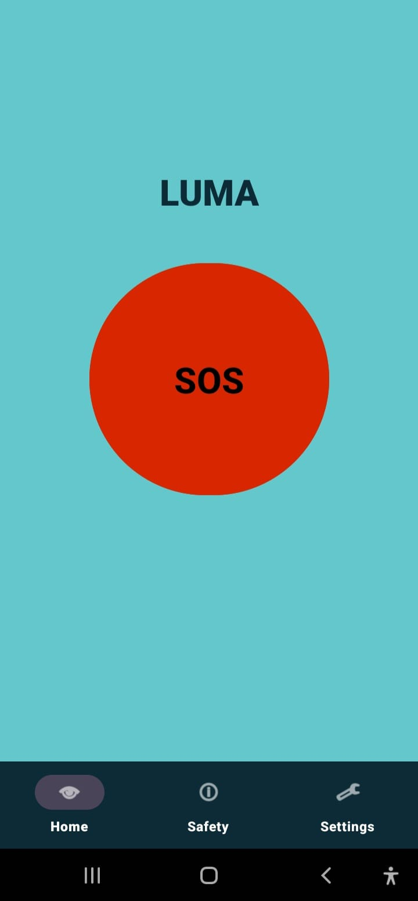
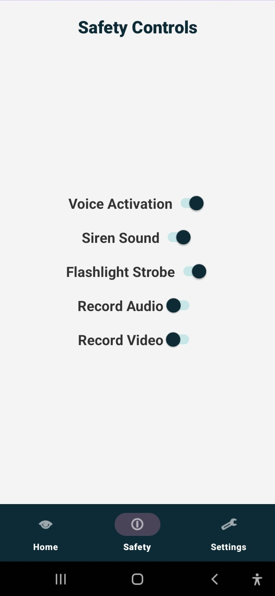
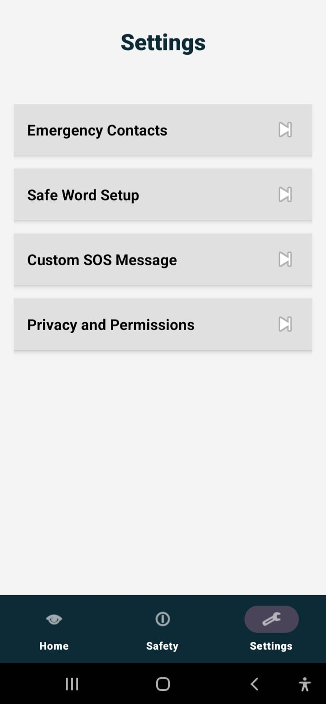
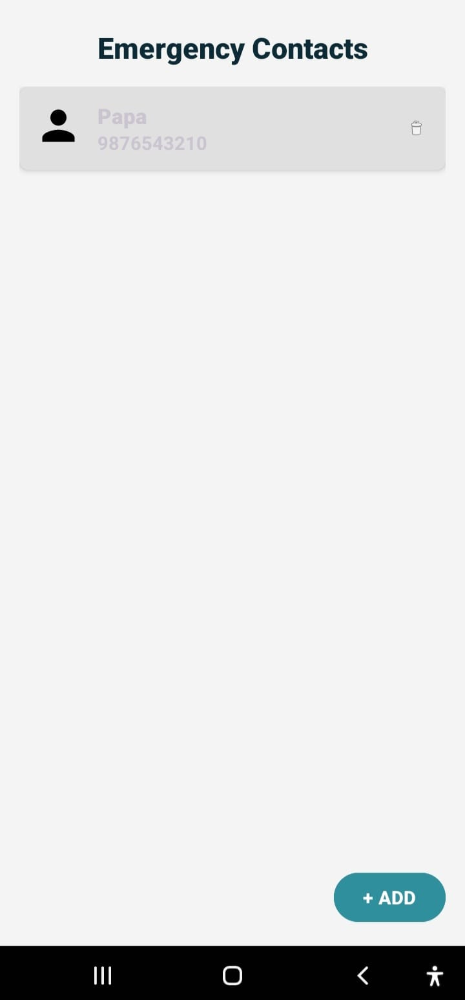
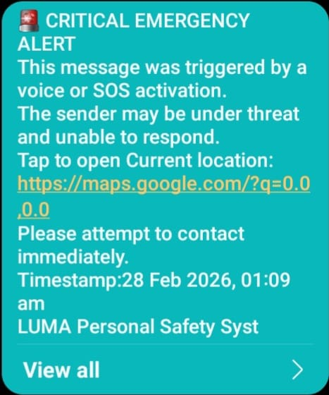

# LUMA – Voice-Activated Personal Safety System

**Finalist Project – Allianz Tech Championship 2026**

LUMA is an Android-based personal safety application designed to minimize user effort and reaction time during high-stress emergency situations. The system focuses on hands-free activation, automated alert workflows, and rapid environmental signaling.

This project was developed for the **Allianz Tech Championship 2026**, where it advanced to the final stage and was shortlisted for the final interview round.

## Overview

Traditional emergency applications assume that users can unlock their phone, navigate interfaces, and manually trigger alerts during crisis scenarios. However, real-world emergencies often impair motor control, focus, and decision-making ability.

LUMA addresses this gap by reducing physical interaction and cognitive load through voice-triggered activation and automated response mechanisms.

## Key Features

* **Voice-Activated SOS Trigger**
  Detects predefined keywords such as “help” or “SOS” using Android’s SpeechRecognizer API.

* **Manual SOS Activation**
  One-tap emergency trigger for immediate action.

* **Emergency Contact Management**
  Stores and retrieves trusted contacts locally using SharedPreferences.

* **Automatic Location Sharing**
  Uses FusedLocationProviderClient to generate a live Google Maps link.

* **SMS Integration**
  Opens the default messaging application with a pre-filled emergency message containing real-time location details.

* **Alert Mode Activation**
  Activates:

  * Siren sound using MediaPlayer
  * Flashlight strobe using CameraManager API

  Designed to:
  * Attract nearby attention
  * Increase visibility
  * Potentially deter threats

* **Permission-Compliant Design**
  Runtime handling for Location, Microphone, SMS, and Camera permissions.
  ## Screenshots

  
  
  

  
  
   

## System Flow
1. Voice trigger or manual SOS activation
2. Location retrieval via FusedLocationProviderClient
3. Pre-filled emergency SMS with Maps link generated
4. Alert screen launches
5. Siren and flashlight strobe activate

The system is structured to minimize interaction steps during high-risk scenarios.

## Technical Stack
**Language:** Java
**Platform:** Android SDK

**Core Components:**
* SpeechRecognizer API (Voice Detection)
* FusedLocationProviderClient (Location Services)
* CameraManager API (Flashlight Control)
* MediaPlayer (Audio Siren)
* SharedPreferences (Local Data Storage)
* Intent-Based SMS Integration

**Architecture Approach:**
* Event-driven activation model
* Local-first storage (no backend dependency in POC stage)
* Android permission model compliance

## Privacy & Security Considerations
* Voice detection operates only when explicitly enabled.
* No background recording occurs without user consent.
* Location is shared only during SOS activation.
* Contacts and settings are stored locally.
The application adheres to Android’s standard runtime permission framework.

## Design Philosophy
LUMA is built around behavioral response principles rather than feature density. During emergencies:

* Reaction time decreases
* Fine motor control reduces
* Cognitive load increases

The system prioritizes automation, simplicity, and rapid environmental signaling over complex UI interaction.

## Future Scope
* Continuous background voice listening (advanced implementation)
* Backend-based automatic SMS dispatch
* Secure cloud-based alert broadcasting
* Wearable device trigger integration
* AI-assisted environmental risk detection

## How to Run
1. Clone the repository.
2. Open the project in Android Studio.
3. Grant required permissions (Location, Microphone, SMS, Camera).
4. Run on a physical Android device for full functionality.

## Status
Proof-of-Concept (POC) – Functional Implementation
Developed for Allianz Tech Championship 2026
Shortlisted for Final Interview Round.

